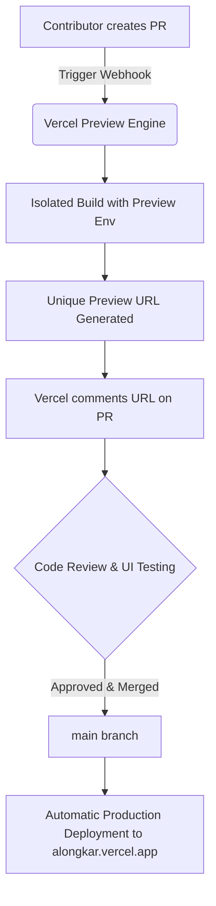

<div align="center">

# ✨ Alongkar (অলংকার) ✨

### *Timeless Heritage • Modern Grace • Handcrafted Luxury*

[](https://alongkar.vercel.app)
[](https://react.dev)
[](https://www.typescriptlang.org/)
[](https://tailwindcss.com)
[](https://vite.dev)
[](https://clerk.com)
[](https://github.com/Snehasish321/Alongkar/pulls)

<p align="center">
  <a href="#-about-alongkar">About</a> •
  <a href="#-key-features">Key Features</a> •
  <a href="#-tech-stack">Tech Stack</a> •
  <a href="#-project-architecture">Project Structure</a> •
  <a href="#-getting-started">Getting Started</a> •
  <a href="#-environment-variables">Environment Variables</a> •
  <a href="#-ci--cd-deployment-workflow">CI/CD & Previews</a> •
  <a href="#-contributing">Contributing</a>
</p>

---

</div>

## 📖 About Alongkar

**Alongkar (অলংকার)** is a premier, contemporary e-commerce web platform designed for luxury jewelry and royal bridal wear. Inspired by rich traditional Indian craftsmanship, Royal Polki, Kundan designs, and modern minimalist gold aesthetics, Alongkar bridges timeless heritage with modern online shopping.

Built with bleeding-edge web technologies—**React 19**, **Tailwind CSS v4**, **TypeScript**, and **Vite**—Alongkar delivers a lightning-fast, visually captivating, and accessible luxury shopping experience.

---

## 💎 Key Features

- **👑 Rich Luxury Aesthetics & Micro-interactions**: Smooth transitions, backdrop blurs, luxury gold palettes, and subtle animations powered by **Framer Motion** and **Lottie**.
- **🛍️ Complete E-Commerce Workflow**:
  - **Dynamic Catalog & Filtering**: Browse by collections (Earrings, Necklaces, Rings, Bracelets, Chains, Pendants), price range, and search tags.
  - **Interactive Search Modal**: Instant real-time fuzzy search with keyboard shortcuts (`Cmd/Ctrl + K`).
  - **Slide-Over Cart Drawer**: Real-time quantity adjustment, coupon code application, free-shipping progress indicators, and total calculations.
  - **Wishlist Drawer**: Save favorite pieces with one click and move them directly to the bag.
- **🔐 Seamless Authentication**: Embedded modal and OAuth sign-in/sign-up powered by **Clerk** with automatic guest-to-user action preservation.
- **📱 Responsive & Accessible**: Mobile-first design featuring an intuitive bottom navigation bar, off-canvas navigation drawer, and touch-friendly controls.
- **⚡ Blazing Fast Performance**: Sub-second initial load times, tree-shaken chunks with Rolldown / Vite 8, and optimized asset delivery.

---

## 🛠️ Tech Stack

| Domain | Technologies & Libraries |
| :--- | :--- |
| **Core Framework** | [React 19](https://react.dev/) + [TypeScript](https://www.typescriptlang.org/) + [Vite 8](https://vite.dev/) |
| **Routing** | [React Router v7](https://reactrouter.com/) |
| **Styling & Design** | [Tailwind CSS v4](https://tailwindcss.com/) + PostCSS + CSS Variables |
| **Animations** | [Framer Motion](https://www.framer.com/motion/) + [Lottie React](https://github.com/Gamote/lottie-react) |
| **Icons** | [Lucide React](https://lucide.dev/) |
| **Authentication** | [@clerk/clerk-react](https://clerk.com/) |
| **Code Quality** | [Oxlint](https://oxc.rs/) (Next-gen ultra-fast linter) |
| **Hosting & CI/CD** | [Vercel](https://vercel.com/) (Production + Automatic PR Preview Deployments) |

---

## 📂 Project Architecture

```
Alongkar/
├── public/                  # Static assets & icons
│   ├── favicon.svg
│   └── site.webmanifest
├── src/
│   ├── assets/              # Brand media, vector artwork, & Lottie JSONs
│   ├── components/
│   │   ├── auth/            # Clerk auth modals & user dropdowns
│   │   ├── collections/     # Collection banners & grid layouts
│   │   ├── common/          # Badges, spinners, & reusable micro-components
│   │   ├── home/            # Hero section, categories, trending, testimonials
│   │   ├── layout/          # Navbar, AnnouncementBar, Footer, Cart & Wishlist Drawers
│   │   ├── products/        # ProductCard, ProductGrid, QuickView modals
│   │   └── ui/              # Buttons, inputs, modals, sheet drawers
│   ├── context/             # Global state (CartContext, WishlistContext, AuthContext)
│   ├── data/                # Product catalogs, categories & static mock datasets
│   ├── hooks/               # Custom React hooks (useDebounce, useMediaQuery)
│   ├── lib/                 # Utility helpers (cn, formatPrice, analytics)
│   ├── pages/               # Route views (HomePage, ShopPage, Collections, About, Contact)
│   ├── types/               # TypeScript interfaces & domain models
│   ├── App.tsx              # Root component & route definitions
│   └── main.tsx             # Application bootstrap & Clerk provider
├── .env.example             # Template for required environment keys
├── vercel.json              # Vercel deployment & SPA rewrite routing
├── vite.config.ts           # Vite bundler, chunking & build configuration
└── package.json             # Project dependencies & scripts
```

---

## 🚀 Getting Started

### Prerequisites
- **Node.js**: `v18.0.0` or higher
- **npm** / **pnpm** / **yarn**

### 1. Clone the Repository
```bash
git clone https://github.com/Snehasish321/Alongkar.git
cd Alongkar
```

### 2. Install Dependencies
```bash
npm install
```

### 3. Setup Environment Variables
Create your local `.env` configuration file from the template:
```bash
cp .env.example .env
```

### 4. Start Local Development Server
```bash
npm run dev
```
Open [http://localhost:5173](http://localhost:5173) in your browser.

### 5. Production Build & Linting
```bash
# Run oxlint checks
npm run lint

# Build production bundle with TypeScript checks
npm run build

# Preview production build locally
npm run preview
```

---

## 🔐 Environment Variables

Ensure the following variables are configured in your local `.env` file and Vercel Project Settings:

| Variable | Description | Required | Environment Scope |
| :--- | :--- | :---: | :--- |
| `VITE_CLERK_PUBLISHABLE_KEY` | Public key for Clerk Authentication | Yes | `Production`, `Preview`, `Development` |
| `DATABASE_URL` | PostgreSQL Database Connection URL | Optional | `Production`, `Preview` |
| `DIRECT_URL` | Direct PostgreSQL Connection URL | Optional | `Production`, `Preview` |

---

## 🌐 CI / CD & Deployment Workflow

Alongkar is configured with **Vercel** for continuous integration and automated branch previews:



- **Production Deployment**: Pushes or merges into the `main` branch trigger a zero-downtime production deployment.
- **Automatic PR Preview Deployments**: Every Pull Request receives an isolated, temporary Vercel preview deployment with a unique URL, allowing instant UI verification with zero risk to production.

---

## 🤝 Contributing

Contributions make the open-source community an inspiring place to learn, create, and build. Any contributions to **Alongkar** are **greatly appreciated**!

1. **Fork the Project**
2. **Create a Feature Branch** (`git checkout -b feature/AmazingFeature`)
3. **Commit your Changes** (`git commit -m 'feat: Add AmazingFeature'`)
4. **Push to the Branch** (`git push origin feature/AmazingFeature`)
5. **Open a Pull Request** (Preview deployment will be built automatically!)

---

## 📄 License

This project is licensed under the **MIT License** — feel free to use, modify, and distribute.

<div align="center">

Made with ❤️ and ✨ by **[Snehasish](https://github.com/Snehasish321)** and contributors.

</div>
